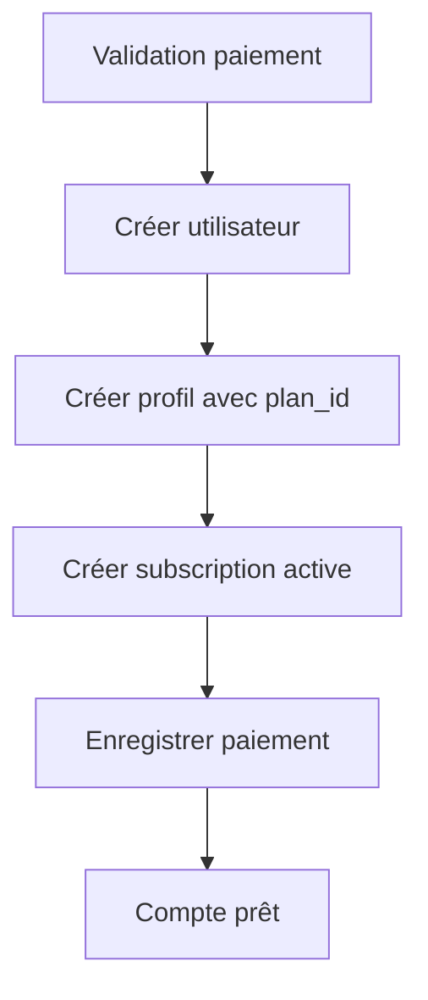

# 🔧 Résolution du problème d'inscription

## ❌ Problème identifié
- **Erreur SQL**: Colonnes manquantes dans la table `profiles` 
- **Colonnes manquantes**: `company`, `phone`, `website`, `work_type`

## ✅ Solution complète

### 1. Mettre à jour la base de données
```bash
# Connectez-vous à votre base de données PostgreSQL et exécutez :
psql -h your-host -U your-user -d your-database -f migration_add_profile_columns.sql
```

### 2. Redémarrer les serveurs
```bash
# Terminal 1 : Frontend
cd /home/dianka/Documents/Bouba'ia
npm run dev

# Terminal 2 : API Backend  
cd /home/dianka/Documents/Bouba'ia/api
npm run dev
```

### 3. Tester le processus complet
```bash
# Rendre le script exécutable et le lancer
chmod +x test_signup.sh
./test_signup.sh
```

## 🎯 Nouveau flux corrigé

### **Plans gratuits** (Starter)
1. **Étape 1** : Formulaire utilisateur ✏️
2. **Étape 2** : Sélection plan gratuit 🆓
3. **Action** : Création compte directe avec `subscription_status: 'active'` ✅

### **Plans payants** (Pro/Enterprise)
1. **Étape 1** : Formulaire utilisateur ✏️  
2. **Étape 2** : Sélection plan payant 💰
3. **Étape 3** : Paiement Wave/Stripe 📱💳
4. **Action** : Validation paiement → Création compte avec `subscription_status: 'active'` ✅

## 🔄 Processus technique backend



## 🧪 API Endpoints ajoutés

- `POST /api/payments` - Enregistrer un paiement
- `GET /api/payments/:userId` - Récupérer les paiements utilisateur

## 🚦 Points de contrôle

- [ ] Migration SQL exécutée
- [ ] API backend redémarrée
- [ ] Frontend redémarré  
- [ ] Test plan gratuit réussi
- [ ] Test plan payant réussi
- [ ] QR Code Wave affiché correctement

## 📋 Résumé des fichiers modifiés

1. **`db.sql`** : Ajout colonnes `company`, `phone`, `website`, `work_type`
2. **`api/auth.ts`** : Correction insertion profil + création subscription
3. **`api/payments.ts`** : Nouvelle API pour gérer les paiements
4. **`api/server.ts`** : Ajout route `/api/payments`
5. **`SignupPage.tsx`** : QR Code Wave image fixed

Maintenant le processus d'inscription respecte bien le principe : **PAIEMENT AVANT CRÉATION** pour les plans payants ! 🎉